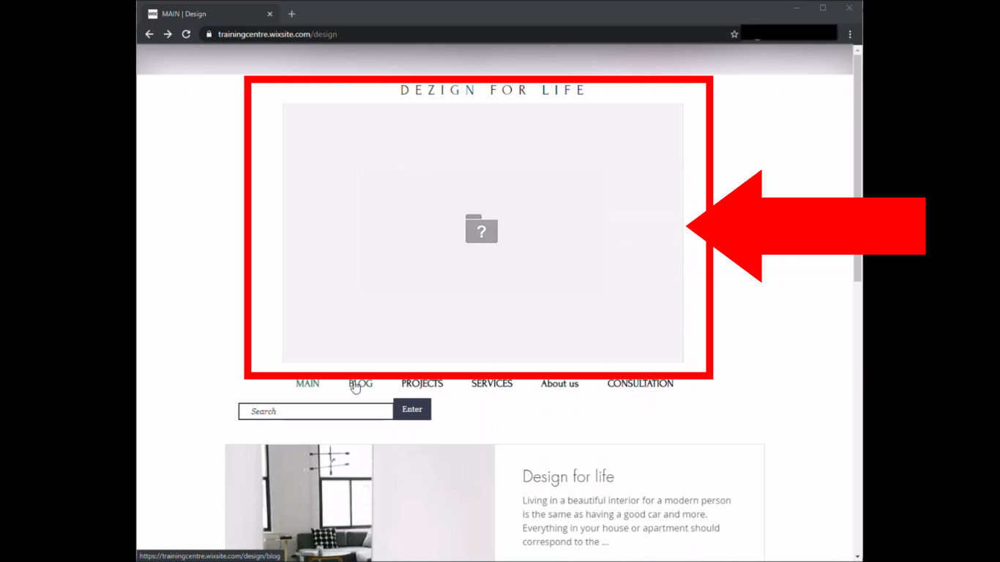
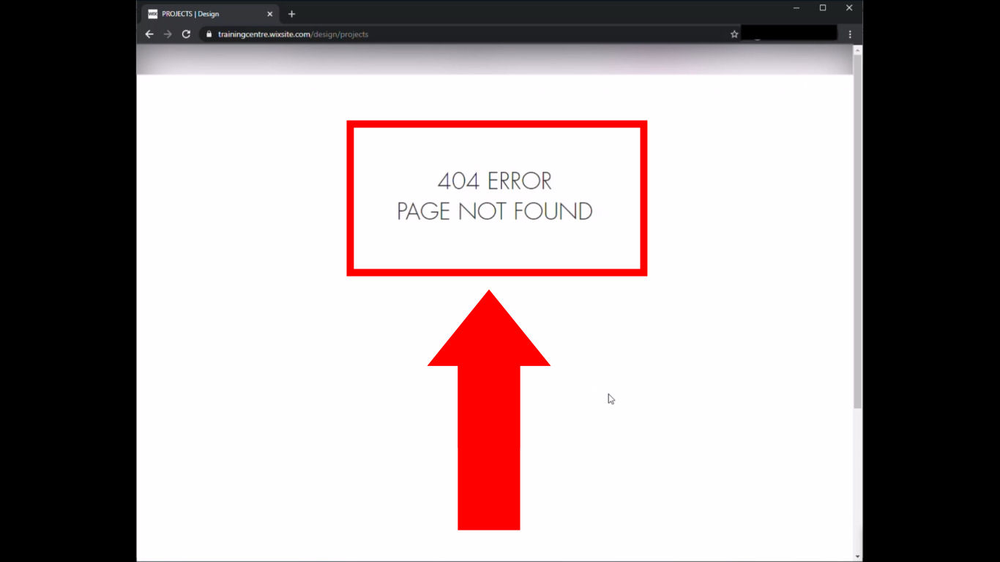
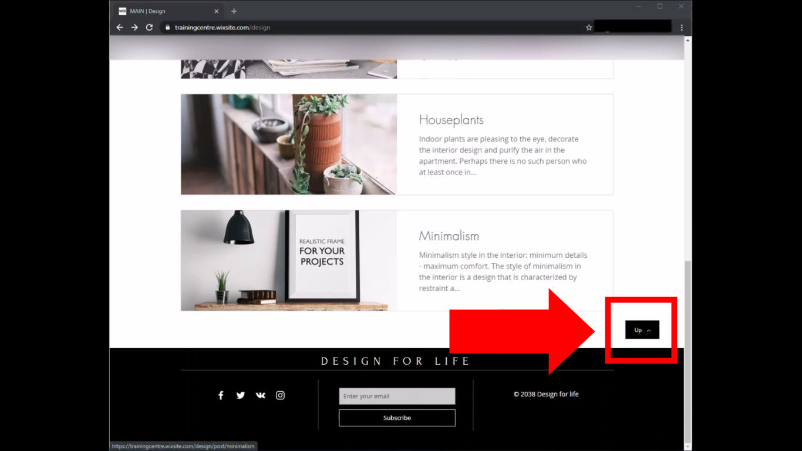

# Fundamentals of Software Testing

## Homework #1 - Reporting bugs
- Describe 1-3 bugs in the Mantis bug tracker from the given video file. 
- Specify the environment in which the video with defects was found: `Browser: Google Chrome 87.0.4280.88`,  `OS: Windows 10 x64`

### Issue #0933301

**Priority**: high

**Severity**: minor

**Reproducibility**: N/A

**Platform**: Google Chrome 87.0.4280.88

**OS**: Windows

**OS Version**: 10 x64

**Summary**: 0933301: Image is missed on carousel on 'Design' page

**Description:** One of the images on top carousel is missed on 'Design' page.

**Steps To Reproduce::**
1. Open page http://trainingcentre.wixsite.com/design
2. Pay attention to the top images carousel.

**Actual result:** One of the images on top carouser is missed on 'Design' page.

**Expected result:** All images on top carouser are presented on 'Design' page.

**Screenshot:**

### Issue #0933305

**Priority**: high

**Severity**: major

**Reproducibility**: N/A

**Platform**: Google Chrome 87.0.4280.88

**OS**: Windows

**OS Version**: 10 x64

**Summary**: 0933305: 404 error is shown on 'Projects' page after clicking in top menu

**Description:** 404 error (page not found) is shown on 'Projects' page after clicking 'Projects' link in top menu on 'Design' page.

**Steps To Reproduce::**
1. Open page http://trainingcentre.wixsite.com/design
2. Click 'Projects' link in top menu below header image.
3. Pay attention to the error message on center of the page.

**Actual result:** 404 error is shown on 'Projects' page after clicking 'Projects' link on 'Design' page.

**Expected result:** 'Projects' page is shown on 'Projects' page after clicking 'Projects' link on 'Design' page.

**Screenshot:**

### Issue #0933305

**Priority**: low

**Severity**: minor

**Reproducibility**: N/A

**Platform**: Google Chrome 87.0.4280.88

**OS**: Windows

**OS Version**: 10 x64

**Summary**: 0933311: Design page is not scrolled to the top after clicking 'Up' button

**Description:** 'Design' page is not scrolled to the top after clicking 'Up' button on bottom of the page right above the footer.

**Steps To Reproduce::**
1. Open page http://trainingcentre.wixsite.com/design
2. Scroll to the bottom of page.
3. Click on the 'Up' button on the right side above the footer.
4. Pay attention to the current position on the page.

**Actual result:** 'Design' page is not scrolled to the top after clicking 'Up' button on bottom of the page.

**Expected result:** 'Design' page is scrolled to the top after clicking 'Up' button on bottom of the page.

**Screenshot:**

