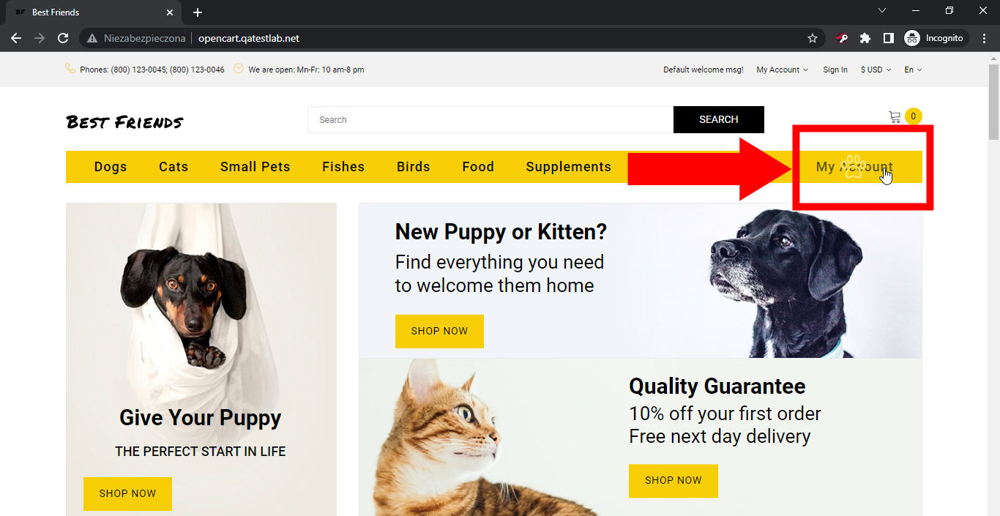
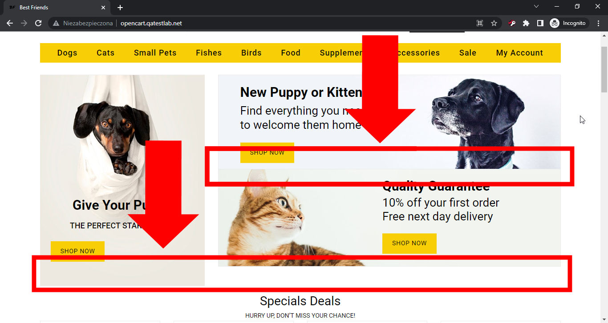
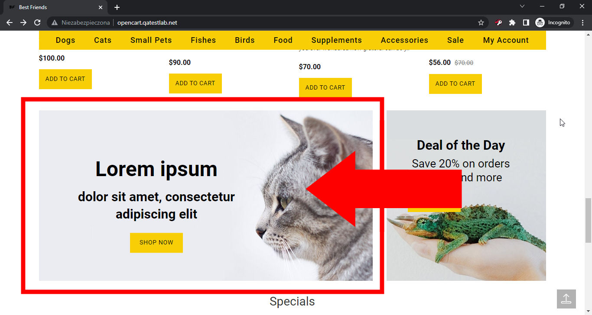
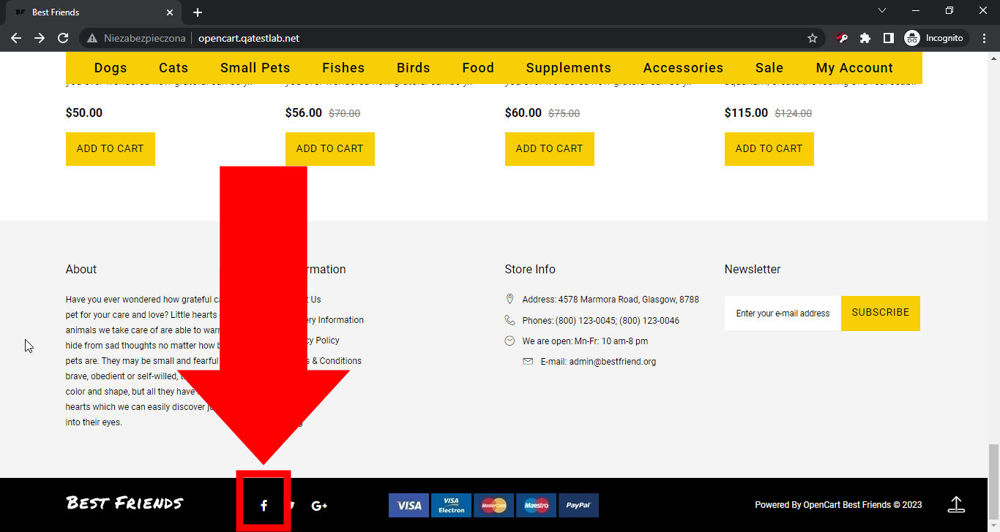
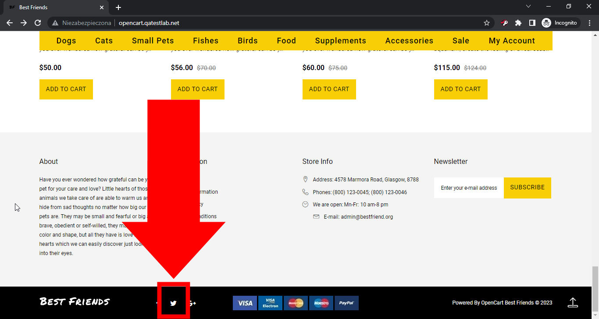
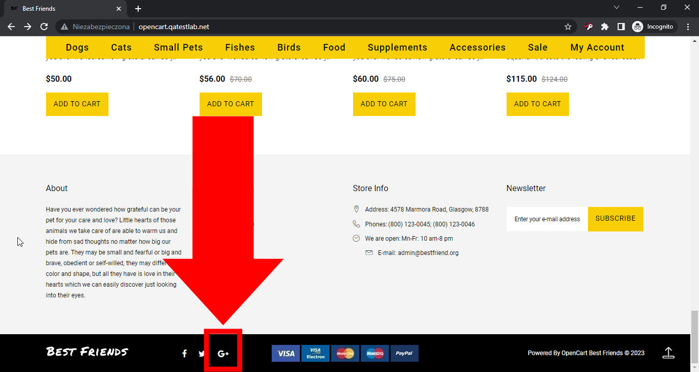
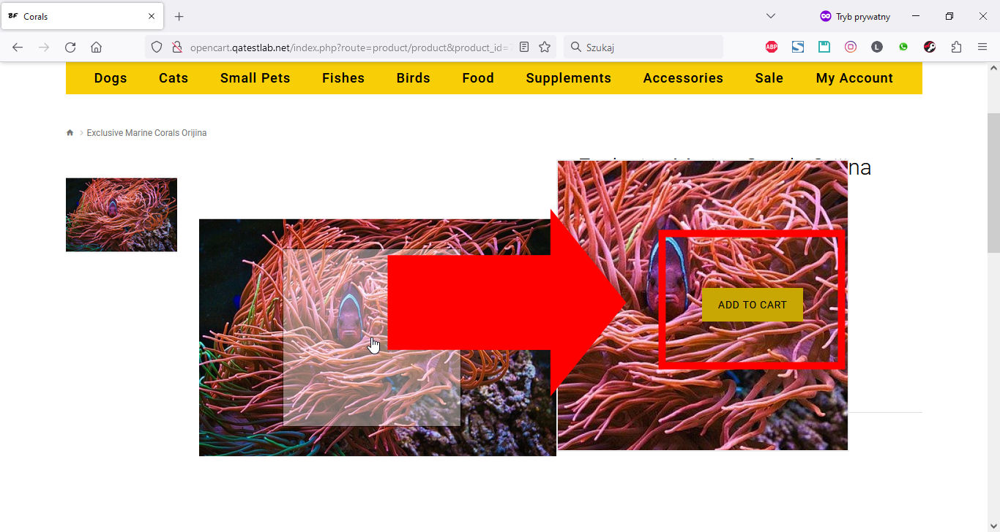

# Fundamentals of Software Testing

## Homework #2 - Reporting bugs
- Add new points and pass the checklist of layout and cross-browser testing: http://opencart.qatestlab.net/
- Add at least 5-8 bugs in the bug-tracker found on the test site
- Add at least 5-6 new points, mark them with some color. 
- Perform testing at least in 3 browsers (For example: Google Chrome, Mozilla Firefox, Microsoft Edge, Opera and others).
- Enter the name and version of the browser 
- Mark the results for all checked items - Passed/Failed. If point checked as “Failed” put the link to the bug-report in the notes (at least 5 links) or the bug summary according to the principle of “What? Where? When?” (if 5 links are already added)

## The task
- Make a copy of the document and rename, indicating your name
- Specify the names and versions of browsers
- Add at least 5-7 new items (be sure to mark them with some color)
- Check all items in different browsers (at least 3) and mark "Passed" (highlight in green) or "Failed" (highlight in red)
- For all items marked as "Failed" in the comments / notes it is necessary to add link to the bug-report (at least 5 links) in the bug tracker (http: // ...) or a note with the bug subject on the principle "What? Where? When?"
- Write at least 5 bug reports

## [Fundamentals of Software Testing: Website layout checklist - Homework #2](https://htmlpreview.github.io/?https://github.com/lukmarcus/Today-I-Learned/blob/main/Fundamentals_of_Software_Testing/Homework_2/Website_layout_checklist.html)

### Issue #0934385

**Priority**: low

**Severity**: minor

**Reproducibility**: always

**Platform**: Google Chrome 112.0.5615.50

**OS**: Windows

**OS Version**: 10 x64

**Summary**: 0934385: 'My account' text is covered by a paw symbol after hovering over the top menu

**Description:** 'My account' text is covered by a paw symbol after hovering over the 'My account' option in the top menu.

**Steps To Reproduce:**
1. Open page http://opencart.qatestlab.net/
2. Locate the top menu with the shop categories.
3. Hover over the 'My account' option in the top menu.
4. Pay attention to the paw symbol that appears.

**Actual result:** 'My account' text is covered by the paw symbol after hovering over the 'My account' option in the top menu.

**Expected result:** 'My account' text is not covered by the paw symbol after hovering over the 'My account' option in the top menu.

**Screenshot:**

**Additional Information:** The same issue occurs on:
- Mozilla Firefox 111.0.1
- Microsoft Edge 112.0.1722.34

### Issue #0934419

**Priority**: normal

**Severity**: minor

**Reproducibility**: always

**Platform**: Google Chrome 112.0.5615.50

**OS**: Windows

**OS Version**: 10 x64

**Summary**: 0934419: The top right banners are placed without a gap on the main page

**Description:** Two top-right banners are placed without a gap on the main page below the top menu. Without this gap, the left and right banner columns are not aligned at the bottom.

**Steps To Reproduce:**
1. Open page http://opencart.qatestlab.net/
2. Locate three banners below the top menu with the shop categories.
3. Pay attention to the spacing of two banners in the right column.

**Actual result:** Two top-right banners are placed without a gap on the main page below the top menu.

**Expected result:** Two top-right banners are placed with a gap on the main page below the top menu.

**Screenshot:**

**Additional Information:** The same issue occurs on:
- Mozilla Firefox 111.0.1
- Microsoft Edge 112.0.1722.34

### Issue #0934441

**Priority**: high

**Severity**: text

**Reproducibility**: always

**Platform**: Google Chrome 112.0.5615.50

**OS**: Windows

**OS Version**: 10 x64

**Summary**: 0934441: A banner with the 'Lorem ipsum' text is shown on the main page

**Description:** A banner with the 'Lorem ipsum' template text is shown on the main page above the 'Specials' section.

**Steps To Reproduce:**
1. Open page http://opencart.qatestlab.net/
2. Locate the 'Specials' section header on the page.
3. Pay attention to the banner above the 'Specials' section.

**Actual result:** A banner with the 'Lorem ipsum' template text is shown on the main page above the 'Specials' section.

**Expected result:** A banner with correct text (without the 'Lorem ipsum' template) is shown on the main page above the 'Specials' section.

**Screenshot:**

**Additional Information:** The same issue occurs on:
- Mozilla Firefox 111.0.1
- Microsoft Edge 112.0.1722.34

### Issue #0934451

**Priority**: high

**Severity**: tweak

**Reproducibility**: always

**Platform**: Google Chrome 112.0.5615.50

**OS**: Windows

**OS Version**: 10 x64

**Summary**: 0934451: An incorrect Facebook link is used on the social media button in the footer

**Description:** The link to the incorrect Facebook page is used on the Facebook social media button in the footer. The link goes to the 'QATestLab' page instead of the 'Best Friends' page.

**Steps To Reproduce:**
1. Open page http://opencart.qatestlab.net/
2. Scroll to the bottom of the main page.
3. Click the Facebook icon on the footer.
4. Pay attention to the name and content of opened Facebook page.

**Actual result:** The link to the incorrect Facebook page ('QATestLab') is used on the Facebook social media button in the footer.

**Expected result:** The link to the correct Facebook 'Best Friends' page is used on the Facebook social media button in the footer.

**Screenshot:**

**Video:** [0934451.webm](0934451.webm)

**Additional Information:** The same issue occurs on:
- Mozilla Firefox 111.0.1
- Microsoft Edge 112.0.1722.34

### Issue #0934456

**Priority**: high

**Severity**: tweak

**Reproducibility**: always

**Platform**: Google Chrome 112.0.5615.50

**OS**: Windows

**OS Version**: 10 x64

**Summary**: 0934456: An incorrect Twitter link is used on the social media button in the footer

**Description:** The link to the incorrect Twitter page is used on the Twitter social media button in the footer. The link goes to 'https://twitter.com/404' instead of the 'Best Friends' account.

**Steps To Reproduce:**
1. Open page http://opencart.qatestlab.net/
2. Scroll to the bottom of the main page.
3. Click the Twitter icon on the footer.
4. Pay attention to the webpage address of opened Twitter page.

**Actual result:** The link to the incorrect Twitter page ('https://twitter.com/404') is used on the Twitter social media button in the footer.

**Expected result:** The link to the correct Twitter 'Best Friends' account is used on the Twitter social media button in the footer.

**Screenshot:**

**Video:** [0934456.webm](0934456.webm)

**Additional Information:** The same issue occurs on:
- Mozilla Firefox 111.0.1
- Microsoft Edge 112.0.1722.34

### Issue #0934460

**Priority**: high

**Severity**: tweak

**Reproducibility**: always

**Platform**: Google Chrome 112.0.5615.50

**OS**: Windows

**OS Version**: 10 x64

**Summary**: 0934460: Google+ (dead portal) link is used as the social media button in the footer

**Description:** Google+ link is used as the social media button in the footer. It's a dead link because Google+ was shut down for business and personal use on April 2, 2019.

**Steps To Reproduce:**
1. Open page http://opencart.qatestlab.net/
2. Scroll to the bottom of the main page.
3. Pay attention to the Google+ icon on the footer.

**Actual result:** Google+ link is used as the social media button in the footer.

**Expected result:** No Google+ link is used as the social media button in the footer.

**Screenshot:**

**Additional Information:** The same issue occurs on:
- Mozilla Firefox 111.0.1
- Microsoft Edge 112.0.1722.34

### Issue #0934525

**Priority**: high

**Severity**: major

**Reproducibility**: always

**Platform**: Google Chrome 112.0.5615.50

**OS**: Windows

**OS Version**: 10 x64

**Summary**: 0934525: Zoomed photo is covered by the 'ADD TO CART' button after adding the product to the cart and hovering over its photo

**Description:** Zoomed product photo is covered by the 'ADD TO CART' button on the product page after adding the product to the cart and hovering over the product photo.

**Steps To Reproduce:**
1. Open page http://opencart.qatestlab.net/
2. Locate the 'Specials' section header on the page.
3. Click on the name of the product 'Exclusive Marine Corals Orijina' in the 'Specials' section.
4. Click the 'ADD TO CART button.'
5. Hover over a bigger product photo.
6. Pay attention to the zoomed product photo.

**Actual result:** Zoomed product photo is covered by the 'ADD TO CART' button on the product page after adding the product to the cart and hovering over the product photo.

**Expected result:** Zoomed product photo is not covered by the 'ADD TO CART' button on the product page after adding the product to the cart and hovering over the product photo.

**Screenshot:**

**Video:** [0934525.webm](0934525.webm)

**Additional Information:** The same issue occurs on:
- Mozilla Firefox 111.0.1
- Microsoft Edge 112.0.1722.34
